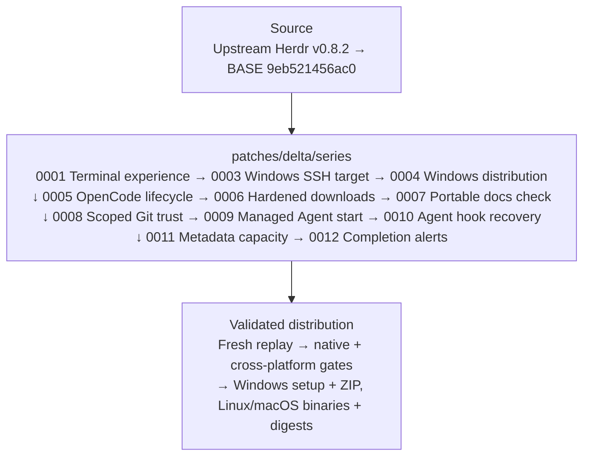

# herdr-win

**An upstream-friendly [Herdr](https://github.com/herdrdev/herdr) distribution for developers who need extended capabilities today: multi-Agent workflow extensions, terminal experience improvements, OpenCode integrations, and first-class Windows support.**

[](https://github.com/hdosys/herdr-win/releases/latest) [](https://github.com/hdosys/herdr-win/actions/workflows/ci.yml) [](https://github.com/hdosys/herdr-win/actions/workflows/release.yml) [](https://github.com/hdosys/herdr-win/blob/master/rust-toolchain.toml) [](https://github.com/hdosys/herdr-sandbox) [](https://github.com/hdosys/herdr-win/blob/master/LICENSE)

Despite its historical name, `herdr-win` is not Windows-only. It is an unofficial, upstream-first extended distribution that makes practical bug fixes and extensions available today through a small, reviewable patch queue designed for upstream adoption. Its strongest focus areas are multi-Agent workflows, terminal experience, OpenCode reliability, and Windows support. It complements upstream Herdr while the executable, command, configuration, state, sessions, sockets, and protocol remain `herdr`.

Every published release contains matching Windows, Linux, and macOS binaries built from one reviewed stable Herdr release and one ordered patch queue. Releases are normal stable GitHub releases, and the integrated update paths reject prerelease feeds.

[What differs from upstream](#what-differs-from-upstream) · [Install](#install) · [First use](#first-use) · [Everyday use](#everyday-use) · [Troubleshooting](#troubleshooting) · [Project reference](#project-reference)

## See it in action

https://github.com/user-attachments/assets/b6c02367-683b-4a1f-94e6-b662149d89d9

Detach from a Windows-hosted Herdr session, reconnect from another terminal, and continue the same OpenCode session without RDP.

## Engineering approach

- **Upstream-first and contribution-oriented:** each behavior has one responsibility-owned mailbox designed for focused upstream review and leaves the queue when equivalent support ships upstream.
- **One coherent distribution:** all supported clients, servers, and provisioned remote runtimes come from the same source tree, build identity, and wire protocol.
- **Real boundary evidence:** Windows setup, ConPTY packaging, SSH provisioning, updates, uninstall, and cross-platform artifacts are exercised at their product-owned boundaries before publication.
- **No parallel product:** fork identity stays in repository, release, update-feed, setup, and Installed Apps presentation while normal Herdr commands and state remain unchanged.

## How it works



[`patches/delta/BASE`](https://github.com/hdosys/herdr-win/blob/master/patches/delta/BASE) records the exact reviewed upstream stable commit. [`series`](https://github.com/hdosys/herdr-win/blob/master/patches/delta/series) is the only patch order. A manual build replays that source and retains one complete candidate; promotion publishes those exact bytes without rebuilding or repackaging them.

## What differs from upstream

The table is intentionally capability-level. The linked mailboxes contain the exact implementation and focused evidence.

| Area | Status | What this repository contributes |
| --- | --- | --- |
| Native ConPTY foundation | **Upstreamed in Herdr v0.6.9** | Reuses Herdr's modern app-local ConPTY packaging instead of carrying a duplicate foundation. |
| Terminal experience | **Maintained here** · [`0001`](https://github.com/hdosys/herdr-win/blob/master/patches/delta/0001-windows-terminal-appearance.patch) | Follows host light/dark appearance, preserves cursor and Windows VTI input behavior, and avoids unframed OSC 4 palette replies. |
| Windows SSH target support | **Maintained here** · [#2329](https://github.com/herdrdev/herdr/pull/2329) · [`0003`](https://github.com/hdosys/herdr-win/blob/master/patches/delta/0003-windows-remote-attach.patch) | Adds x86_64/ARM64 host detection, exact provisioning and activation, visible interactive progress, and fail-closed detached launch into the SSH user's active desktop session. |
| Managed Windows releases | **Maintained here** · [`0004`](https://github.com/hdosys/herdr-win/blob/master/patches/delta/0004-windows-managed-distribution.patch) | Provides per-user setup, portable archives, immutable runtime activation, update ownership, process-safe uninstall, and stable-only release selection. |
| OpenCode and multi-Agent workflows | **Maintained here** · [#3052](https://github.com/herdrdev/herdr/issues/3052) · [#2450](https://github.com/herdrdev/herdr/issues/2450) · [`0005`](https://github.com/hdosys/herdr-win/blob/master/patches/delta/0005-opencode-retry-notifications.patch) | Keeps retries and prompts truthful, preserves each pane's selected root session, and maps concurrent direct subagents into adaptive readable splits. |
| Runtime downloads | **Maintained here** · [`0006`](https://github.com/hdosys/herdr-win/blob/master/patches/delta/0006-harden-curl-transfers.patch) | Ignores user `curl` configuration and bounds runtime downloads to TLS 1.2+ HTTPS with limited redirects. |
| Cross-platform docs checks | **Maintained here** · [#3041](https://github.com/herdrdev/herdr/issues/3041) · [`0007`](https://github.com/hdosys/herdr-win/blob/master/patches/delta/0007-docs-parity-native-paths.patch) | Keeps the upstream documentation-parity unittest valid with native paths on Windows and POSIX systems. |
| Worktree lifecycle | **Maintained here** · [#3044](https://github.com/herdrdev/herdr/issues/3044) · [`0008`](https://github.com/hdosys/herdr-win/blob/master/patches/delta/0008-worktree-scoped-git-trust.patch) | Scopes Git trust to the selected checkout, waits for Windows terminals before unregistering worktrees, and preserves foreground focus during background removal. |
| Managed Agent start | **Maintained here** · [#321](https://github.com/herdrdev/herdr/issues/321) · [#2685](https://github.com/herdrdev/herdr/issues/2685) · [`0009`](https://github.com/hdosys/herdr-win/blob/master/patches/delta/0009-session-agent-autostart.patch) | Optionally starts one Agent in each new tab, catches up eligible shell roots after live reload, and resolves argument-bearing Windows shims reliably. |
| Agent hook recovery | **Maintained here** · [#1033](https://github.com/herdrdev/herdr/issues/1033) · [`0010`](https://github.com/hdosys/herdr-win/blob/master/patches/delta/0010-agent-transient-hook-takeover.patch) | Lets a still-running full-lifecycle Agent regain hook authority after a temporary foreground takeover without reviving a session after a real exit. |
| Metadata capacity | **Maintained here** · [`0011`](https://github.com/hdosys/herdr-win/blob/master/patches/delta/0011-metadata-token-capacity.patch) | Atomically updates and retains up to 64 pane or workspace metadata tokens while preserving existing validation bounds. |
| Completion alerts | **Maintained here** · [`0012`](https://github.com/hdosys/herdr-win/blob/master/patches/delta/0012-agent-completion-controls.patch) | Exposes one persistent opt-out for completion popups and sounds while keeping questions, permission prompts, and errors actionable. |

## Install

### Requirements

- The managed Windows setup and portable ZIP target Windows x86_64.
- Setup is per-user, requires no administrator access, and needs no separately installed Microsoft Visual C++ Redistributable.
- Linux amd64/arm64 and macOS amd64/arm64 are available as matching raw executables.

WinGet-owned installations update through WinGet. Direct and portable installations update through the fork-owned release feed. `herdr update` deliberately refuses to replace package-managed bytes.

### WinGet

Install from the WinGet community source:

```powershell
winget install --id hdosys.herdr-win --exact --source winget
```

### Direct setup

Download `herdr-win_v<version>_windows_amd64_setup.exe` from the [latest Herdr Win release](https://github.com/hdosys/herdr-win/releases/latest), verify its GitHub SHA-256 digest, and run it.

<p align="center">
  
</p>

The managed install lives under `%LOCALAPPDATA%\Programs\Herdr`, registers **Herdr Win** in Installed Apps, installs Herdr's canonical agent skill, and preserves customized skill copies.

### Portable and cross-platform assets

The Windows release also includes `herdr-win_v<version>_windows_amd64.zip`. Extract the complete archive into one directory and run `herdr.exe`; keep its ConPTY payload beside it.

Linux and macOS releases are raw `linux_amd64`, `linux_arm64`, `macos_amd64`, and `macos_arm64` executables. Use assets from the same herdr-win release on every endpoint because independently released builds are not guaranteed to share this fork's wire protocol.

After downloading a Linux or macOS asset, mark it executable, rename it to `herdr`, and place it in a directory on `PATH`.

> [!WARNING]
> The executable and setup are currently unsigned, so Windows may show a SmartScreen warning. Download only from this repository and verify the SHA-256 digest before running the artifact.

## First use

Open a new terminal after installation and run:

```powershell
herdr --version
herdr
```

A published build reports `herdr-win <CalVer> (Herdr <upstream-version>)`. The second command opens Herdr's normal keyboard-first terminal interface. General commands, configuration, keybindings, and integrations remain documented by the [official Herdr guide](https://herdr.dev/docs/).

## Everyday use

### Mixed-platform sessions

Run the client and server on Windows, or use a matching Linux or macOS binary to control a Windows workstation or VM. Windows can also connect to matching Linux and macOS endpoints.

Every supported client can attach to or provision an x86_64 or ARM64 Windows SSH host. Unattended provisioning is explicit:

```powershell
herdr --remote workbox --provision --yes --json
```

The Windows SSH user's OpenSSH default shell must be `cmd.exe` or PowerShell 7 (`pwsh.exe`), and persistent server launch requires exactly one active desktop session owned by that user. Provisioning validates the complete payload before stopping or replacing a server and verifies the exact binary, version, and protocol afterward.

### Fork-specific options

Start OpenCode automatically in the root pane of each genuinely new persistent-session tab:

```toml
[session]
auto_start_agent = "opencode"
```

Use **Settings > completion**, or disable completion popups and done sounds without suppressing questions, permission prompts, or errors:

```toml
[ui]
notify_on_agent_completion = false
```

### Updates

- WinGet-owned installation: `winget upgrade --id hdosys.herdr-win --exact --source winget`
- Direct setup or portable installation: `herdr update`

Direct updates accept only a newer stable CalVer from an immutable normal GitHub release. Active sessions continue on their current immutable runtime and the replacement activates safely afterward; update never terminates running work.

## Uninstall

Uninstall from **Windows Settings > Apps > Installed apps**. Herdr first asks running managed sessions to stop through their graceful server API. If a session remains active, uninstall preserves the installation and reports the required action instead of force-terminating work.

Settings under `%USERPROFILE%\.herdr` are preserved unless you explicitly choose to remove them. Installer-owned skill files can also be removed explicitly; customized copies and unrelated directory content remain preserved.

## Troubleshooting

| Symptom | Action |
| --- | --- |
| `herdr --version` does not start with `herdr-win` | Open a new terminal, run `where.exe herdr`, and inspect an earlier upstream or user-owned executable on `PATH`. Setup does not overwrite foreign PATH ownership. |
| Setup rejects an existing Herdr layout | Uninstall the existing **Herdr** or **Herdr Win** entry from Installed Apps, then run setup again. The installer preserves and rejects incompatible legacy layouts instead of migrating them. |
| SmartScreen warns about the download | Confirm that the file came from this repository's release page and verify its GitHub SHA-256 digest before choosing to run it. |
| Windows SSH provisioning fails before session start | Confirm that the default OpenSSH shell is `cmd.exe` or `pwsh.exe` and that exactly one active desktop session belongs to the SSH user. Windows PowerShell 5.1 is unsupported for this byte-stream path. |
| Update remains pending, or uninstall reports running sessions | Let active work finish or stop the reported Herdr sessions, then launch or retry. The managed lifecycle never force-terminates active work. |

For exact changes in downloadable fork releases, see the [herdr-win changelog](https://github.com/hdosys/herdr-win/blob/master/CHANGELOG.md). For general Herdr behavior, use the [upstream documentation](https://herdr.dev/docs/) and [upstream changelog](https://github.com/herdrdev/herdr/blob/master/CHANGELOG.md).

## Project reference

This README describes the maintained queue on `master`. The fork-only [changelog](https://github.com/hdosys/herdr-win/blob/master/CHANGELOG.md) is the exact user-facing history for tagged herdr-win releases. Upstream Herdr owns the general CLI, TUI, configuration, integrations, and product documentation.

> [!IMPORTANT]
> GitHub's **ahead/behind** banner compares commit ancestry, not release-source freshness. This repository's `master` is a control branch for the patch queue and release automation, not a mirror of upstream `master`. Each build starts from the stable commit recorded in `BASE` and applies `series`; GitHub's **Sync fork** action is not this project's refresh mechanism.

<details>
<summary><strong>Patch queue and upstream review</strong></summary>

Upstream PR [#2329](https://github.com/herdrdev/herdr/pull/2329) ships in Herdr v0.8.2. Mailbox `0003` therefore contains only the remaining Windows target-host boundary. Shared client attach, image transport, and SSH bridge behavior come directly from upstream.

The original Windows-host work builds on [nsxdavid's `feat/windows-remote-attach` branch](https://github.com/nsxdavid/herdr/tree/feat/windows-remote-attach).

The files in `patches/delta/series` are the complete maintained product delta:

1. Start at the exact commit in [`BASE`](https://github.com/hdosys/herdr-win/blob/master/patches/delta/BASE).
2. Apply [`series`](https://github.com/hdosys/herdr-win/blob/master/patches/delta/series) in order with `git am --3way`.
3. Review each mailbox as one responsibility with its implementation, tests, and documentation.
4. Follow [`CONTRIBUTING.md`](https://github.com/hdosys/herdr-win/blob/master/CONTRIBUTING.md) for replay and verification.

The mailboxes are focused evidence, not an all-or-nothing merge request. Fork branding, release workflows, and publication state stay outside the product queue.

</details>

<details>
<summary><strong>Maintaining the project</strong></summary>

Refresh and release are separate manual operations:

- **Refresh:** select and review a stable upstream release, then replay and minimize the queue.
- **Build:** replay recorded `BASE`, run the complete gates, and retain one candidate with provenance and checksums.
- **Promote:** publish those exact retained bytes without rebuilding or repackaging them.

Ordinary pushes do not publish binaries.

| Need | Canonical owner |
| --- | --- |
| User-visible fork behavior | [`PRODUCT.md`](https://github.com/hdosys/herdr-win/blob/master/PRODUCT.md) |
| Technical boundaries | [`ARCHITECTURE.md`](https://github.com/hdosys/herdr-win/blob/master/ARCHITECTURE.md) |
| Patch ownership and refresh policy | [`patches/delta/README.md`](https://github.com/hdosys/herdr-win/blob/master/patches/delta/README.md) |
| Replay, verification, and release procedure | [`CONTRIBUTING.md`](https://github.com/hdosys/herdr-win/blob/master/CONTRIBUTING.md) |
| Selected future product work | [`BACKLOG.md`](https://github.com/hdosys/herdr-win/blob/master/BACKLOG.md) |

</details>

### Sister project: Herdr Sandbox

herdr-win is developed and validated with [**Herdr Sandbox**](https://github.com/hdosys/herdr-sandbox), a disposable native Windows environment for coding agents. It supplies clean toolchains and realistic Windows boundaries for this fork; it is not a runtime dependency.

### Issues and contributions

- Use [upstream Herdr](https://github.com/herdrdev/herdr) for general behavior that reproduces with an official upstream build.
- Use [herdr-win issues](https://github.com/hdosys/herdr-win/issues) for this distribution's artifacts, update feed, workflows, or maintained patches.
- Read [`CONTRIBUTING.md`](https://github.com/hdosys/herdr-win/blob/master/CONTRIBUTING.md) before changing the queue or release automation.

## Credits and license

Herdr is created and maintained upstream by [Can Çelik](https://github.com/ogulcancelik). herdr-win is distributed under the [Apache License 2.0](https://github.com/hdosys/herdr-win/blob/master/LICENSE).
