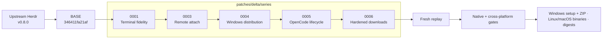

# herdr-win

**Develop on Windows from Linux, macOS, or Windows with a cross-platform [Herdr](https://github.com/herdrdev/herdr) distribution that makes Windows a first-class client and server.**

[](https://github.com/hdosys/herdr-win/actions/workflows/ci.yml) [](https://github.com/hdosys/herdr-win/actions/workflows/release.yml) [](https://github.com/hdosys/herdr-win/blob/master/rust-toolchain.toml) [](https://github.com/hdosys/herdr-sandbox) [](https://github.com/hdosys/herdr-win/blob/master/LICENSE)

Despite its historical name, `herdr-win` is not Windows-only. It is an unofficial, upstream-first cross-platform distribution focused on Windows feature parity. Its defining use case is running a full Herdr server on a Windows workstation or VM while controlling it from the normal Herdr client on Linux, macOS, or Windows.

Every release candidate builds matching Windows, Linux, and macOS binaries from one exact reviewed Herdr release and the same ordered patch queue. That keeps clients, servers, and provisioned remote runtimes on one compatible protocol while preserving the normal `herdr` command and workflow.

[Why it exists](#why-it-exists) · [What it adds](#what-differs-from-upstream) · [Install and cross-platform use](#install-and-cross-platform-use) · [Patch flow](#how-the-patch-queue-works) · [Upstream review](#for-upstream-maintainers) · [Maintaining](#maintaining-the-project) · [Herdr Sandbox](#sister-project-herdr-sandbox)

> [!NOTE]
> This README describes the maintained queue on `master`; use a tagged release's changelog as the exact contract for currently downloadable binaries. Upstream Herdr owns the general CLI, configuration, integrations, and product documentation. This repository owns its Windows-focused delta and cross-platform release. Reproduce general issues with upstream Herdr before reporting them here.

## Why it exists

The reviewed upstream release provides Herdr's cross-platform core. herdr-win supplies the remaining Windows behavior needed for mixed-platform development without treating Windows as a client-only or second-class target:

- **A terminal that feels native:** without explicit theme configuration, Herdr follows the host's light or dark appearance while preserving cursor colors and Windows input through ConPTY.
- **Windows as a Herdr server:** Windows, Linux, and macOS clients can attach to or provision a Windows workstation or VM over SSH with an exact runtime, protocol check, and named-session lifecycle.
- **One release across mixed environments:** matching Windows, Linux, and macOS assets let Herdr provision supported remote endpoints from the same protocol-compatible build instead of relying on manual binary copying or independently released versions.
- **Images cross the remote boundary:** from a Windows remote client, clipboard images and supported image-file drops are staged on the remote host and their usable remote path is pasted into the pane.
- **Updates that respect running work:** per-user setup uses verified immutable runtimes, lets active sessions finish, and activates one coherent replacement afterward without a permanent background service.
- **Agent status that reflects reality:** OpenCode retries stay active instead of surfacing premature failures, while terminal errors remain visible.

The patch queue is how those outcomes stay maintainable, not the reason users should care. Every retained behavior is tied to an exact upstream stable commit and one responsibility-owned mailbox. Candidates are replayed, tested at their native boundaries, packaged as real artifacts, and promoted without rebuilding. When equivalent behavior ships upstream, it is deleted here. That keeps releases reproducible, the engineering reviewable, and the fork small enough to upstream rather than becoming a second Herdr product.

## What differs from upstream

The table is intentionally capability-level. The patch files contain the exact implementation and tests.

| Area | Status | What this repository contributes |
| --- | --- | --- |
| Native ConPTY foundation | ✅ **Upstreamed in Herdr v0.6.9** | Herdr v0.8.0 added the modern app-local ConPTY packaging that herdr-win now reuses instead of carrying a duplicate foundation. |
| Terminal fidelity | **Maintained here** · [`0001`](https://github.com/hdosys/herdr-win/blob/master/patches/delta/0001-windows-terminal-appearance.patch) | Follows host light/dark appearance by default and preserves cursor, rendering, and VTI input behavior in local and attached Windows sessions. |
| Windows remote attach and image bridge | **Partly merged upstream after v0.8.0, release pending** · [#2329](https://github.com/herdrdev/herdr/pull/2329) · [`0003`](https://github.com/hdosys/herdr-win/blob/master/patches/delta/0003-windows-remote-attach.patch) | Adds Windows x86_64/ARM64 host detection, exact runtime provisioning, named-session lifecycle, and an image bridge that turns Windows clipboard or file images into usable remote paths. Upstream now owns Windows client attach to Linux/macOS; the remaining Windows-host delta stays here until the next stable refresh. |
| Managed Windows snapshots | **Maintained here** · [`0004`](https://github.com/hdosys/herdr-win/blob/master/patches/delta/0004-windows-managed-distribution.patch) | Provides per-user setup, portable archives, immutable runtime activation, update ownership, and process-safe uninstall from one verified candidate. |
| OpenCode lifecycle reporting | **Maintained here** · [`0005`](https://github.com/hdosys/herdr-win/blob/master/patches/delta/0005-opencode-retry-notifications.patch) | Keeps active retries active and exposes only actionable terminal failures. |
| Runtime downloads | **Maintained here** · [`0006`](https://github.com/hdosys/herdr-win/blob/master/patches/delta/0006-harden-curl-transfers.patch) | Makes runtime downloads independent of user `curl` configuration and bounds them to TLS 1.2+ HTTPS with limited redirects. |

Upstream PR #2329 merged after v0.8.0 and has not shipped in a stable release yet. Mailbox `0003` therefore remains in the current queue; at the next stable refresh, it can shrink to Windows-host attach and the additional bridge hardening. The original implementation builds on [nsxdavid's `feat/windows-remote-attach` work](https://github.com/nsxdavid/herdr/tree/feat/windows-remote-attach).

## Sister project: Herdr Sandbox

herdr-win is developed and validated with [**Herdr Sandbox**](https://github.com/hdosys/herdr-sandbox), a disposable native Windows development environment for coding agents. It provides the clean Windows toolchains and realistic native boundary used to build and test this fork; it is a sister project, not a runtime dependency.

## How the patch queue works



[`patches/delta/BASE`](https://github.com/hdosys/herdr-win/blob/master/patches/delta/BASE) records the exact upstream stable commit. [`series`](https://github.com/hdosys/herdr-win/blob/master/patches/delta/series) is the only application order. Each patch is a full-index, binary-safe mailbox with one logical responsibility.

An upstream refresh is deliberate: select the latest stable release, replay the complete queue, remove behavior upstream now owns, regenerate changed mailboxes, and verify a fresh replay. `BASE` never follows upstream `master` automatically.

## Install and cross-platform use

Each release is one cross-platform snapshot for Windows x86_64, Linux amd64/arm64, and macOS amd64/arm64. Windows additionally ships the managed per-user setup and portable ZIP; every matching binary can run as a client or remote endpoint on the same wire protocol.

This supports mixed development environments directly: run the managed client and server on Windows, or use a matching Linux or macOS client to control a Herdr server on a Windows workstation or VM. The Linux and macOS builds can also run as remote endpoints when a Windows client connects in the other direction.

Every supported client can attach to an x86_64 or ARM64 Windows SSH host. Herdr uses an exact matching `herdr.exe` from the SSH user's `PATH` or the stable per-user runtime at `%USERPROFILE%\.herdr\remote\bin\herdr.exe`. When that runtime is needed, an interactive attach validates remote configuration, stops the selected server with approval, stages and validates the complete digest-verified Windows portable payload, atomically replaces the stable runtime, removes the transient previous payload, then starts and verifies the new server. Local Windows development builds use the same complete portable layout; Herdr packages the adjacent runtime and rejects an executable without its ConPTY bundle. It never runs setup or changes remote `PATH`; ordinary non-interactive attach leaves the host unchanged. The host's OpenSSH default shell must be `cmd.exe` or PowerShell 7 (`pwsh.exe`) so the interactive bridge remains byte-exact. Windows remote hosts do not support live handoff or OpenSSH control-socket reuse.

For explicit unattended deployment and activation, validate the remote configuration and provision the matching binary with:

```powershell
herdr --remote workbox --provision --yes --json
```

Provision starts a missing server, reloads configuration when the running binary already matches, and saves then restarts only when a different binary must be activated.

### Setup (recommended)

<p align="center">
  
</p>

Download the newest `herdr-win_v<version>_windows_amd64_setup.exe` from [Releases](https://github.com/hdosys/herdr-win/releases) and run it. Setup installs for the current user without administrator access and registers an uninstaller. It adds its managed `bin` directory to the user `PATH` only when no effective equivalent already exists, and never rewrites or claims an equivalent user-owned entry. Open a new terminal and run:

```powershell
herdr --version
herdr
```

Setup also installs Herdr's canonical agent skill at `%USERPROFILE%\.agents\skills\herdr\SKILL.md` and, when Claude Code is detected, in its configured skills directory. Installer-known copies update automatically; customized copies are preserved and reported.

Published builds report `herdr-win <CalVer> (Herdr <upstream-version>)`. Local test builds include their build ID when available, as in `herdr-win local (Herdr <upstream-version>, build <build-id>)`, and omit that clause otherwise. Integrations can use the stable `herdr-win ` prefix to identify this distribution and its Windows-specific features.

The installed distribution owns its update feed. herdr-win has no user-selectable update channel and cannot be redirected to official Herdr update sources through config. CalVer orders fork releases, the build ID identifies the exact immutable runtime and matching remote assets, and the wire protocol gates client/server compatibility.

Running a newer setup over a current managed installation updates it in place and repairs incomplete current installer registration.

For setup downloaded directly from Releases, use `herdr update` from an ordinary terminal after detaching from active Herdr sessions. Updates preserve running sessions and activate the new verified snapshot when it is safe. A WinGet-owned installation instead updates through:

```powershell
winget upgrade --id hdosys.herdr-win --exact --source winget
```

GitHub may publish a snapshot before the WinGet catalog finishes accepting it. A WinGet-owned copy shows an update only after the official `winget` source contains that exact release version, so its update action always points to installable bytes.

Uninstall from **Windows Settings → Apps → Installed apps**. Uninstall first stops running managed Herdr sessions through their graceful server API. If a session cannot stop within the bounded deadline, the managed installation is preserved and the required action is reported. Settings are preserved unless you explicitly choose to remove them. Uninstall never force-terminates sessions or removes unowned or unsafe content.

### Verify the download

GitHub records a SHA-256 digest for every immutable release asset. Before running setup, verify the downloaded file against the `digest` for the same filename in that tagged release's GitHub metadata.

### Portable Windows ZIP

The release also includes `herdr-win_v<version>_windows_amd64.zip`. Extract the complete archive into one directory and run `herdr.exe`.

> [!WARNING]
> The Herdr executable and setup are currently unsigned, so Windows may show a SmartScreen warning. Download release artifacts only from this repository.

### Linux and macOS clients and endpoints

Each release includes raw `linux_amd64`, `linux_arm64`, `macos_amd64`, and `macos_arm64` executables. They are supported unbundled clients and remote endpoints built from the same retained candidate; unlike Windows, they are not managed installers.

Use matching binaries from the same herdr-win release on every endpoint. Independently released official builds are not guaranteed to use the same wire protocol.

For general commands, configuration, and agent integrations, use the [official Herdr documentation](https://herdr.dev/docs/).

## For upstream maintainers

Thank you for the native Windows foundation and the remote-client work merged in [#2329](https://github.com/herdrdev/herdr/pull/2329). herdr-win exists to make remaining Windows behavior easy to inspect, test, and remove from this fork as equivalent support lands upstream. The Windows remote-host follow-up is tracked in [Discussion #2409](https://github.com/herdrdev/herdr/discussions/2409).

The five files in `patches/delta/series` are the complete maintained product delta. Each is self-contained, so its behavior does not need to be reconstructed from this fork's development history.

1. Start at the exact commit in [`BASE`](https://github.com/hdosys/herdr-win/blob/master/patches/delta/BASE).
2. Apply [`series`](https://github.com/hdosys/herdr-win/blob/master/patches/delta/series) in order with `git am --3way`.
3. Review each mailbox as one responsibility-oriented change with its implementation, tests, and documentation.
4. Follow [`CONTRIBUTING.md`](https://github.com/hdosys/herdr-win/blob/master/CONTRIBUTING.md) to reproduce the replay and verification gates.

The mailboxes are offered as focused evidence and acceptance tests, not an all-or-nothing merge request. Upstream can split or reimplement them along its own ownership boundaries; once equivalent behavior ships, herdr-win removes it. Fork branding, release workflows, and publication state stay outside the product queue.

## Maintaining the project

Refresh and release are intentionally separate manual operations:

- **Refresh:** select and review a stable upstream release, then replay and minimize the queue.
- **Build:** replay recorded `BASE`, run the complete gates, and retain one candidate with provenance and checksums.
- **Promote:** publish those exact retained bytes without rebuilding or repackaging them.

Ordinary pushes do not publish binaries.

| Need | Canonical owner |
| --- | --- |
| User-visible fork behavior | [`PRODUCT.md`](https://github.com/hdosys/herdr-win/blob/master/PRODUCT.md) |
| Technical boundaries | [`ARCHITECTURE.md`](https://github.com/hdosys/herdr-win/blob/master/ARCHITECTURE.md) |
| Patch ownership and refresh policy | [`patches/delta/README.md`](https://github.com/hdosys/herdr-win/blob/master/patches/delta/README.md) |
| Replay, verification, and release procedure | [`CONTRIBUTING.md`](https://github.com/hdosys/herdr-win/blob/master/CONTRIBUTING.md) |
| Open work | [`BACKLOG.md`](https://github.com/hdosys/herdr-win/blob/master/BACKLOG.md) |

## Issues and contributions

- Use [upstream Herdr](https://github.com/herdrdev/herdr) for general product behavior that reproduces with an official upstream build.
- Use [herdr-win issues](https://github.com/hdosys/herdr-win/issues) for this distribution's artifacts, update feed, workflows, or maintained patches.
- Read [`CONTRIBUTING.md`](https://github.com/hdosys/herdr-win/blob/master/CONTRIBUTING.md) before changing the queue or release automation.

## Credits and license

Herdr is created and maintained upstream by [Can Çelik](https://github.com/ogulcancelik). herdr-win is distributed under the [Apache License 2.0](https://github.com/hdosys/herdr-win/blob/master/LICENSE).
